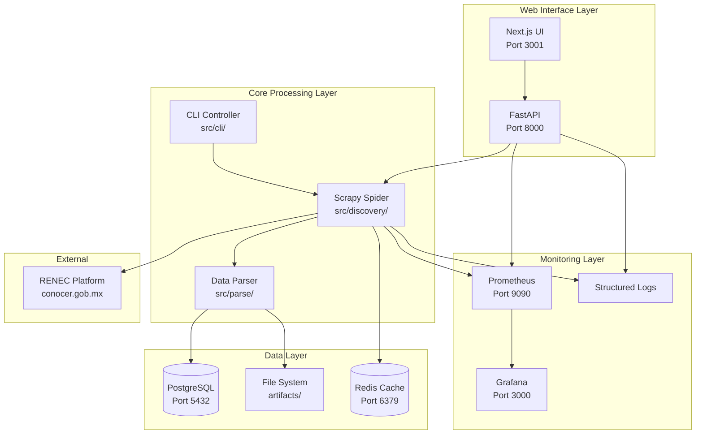
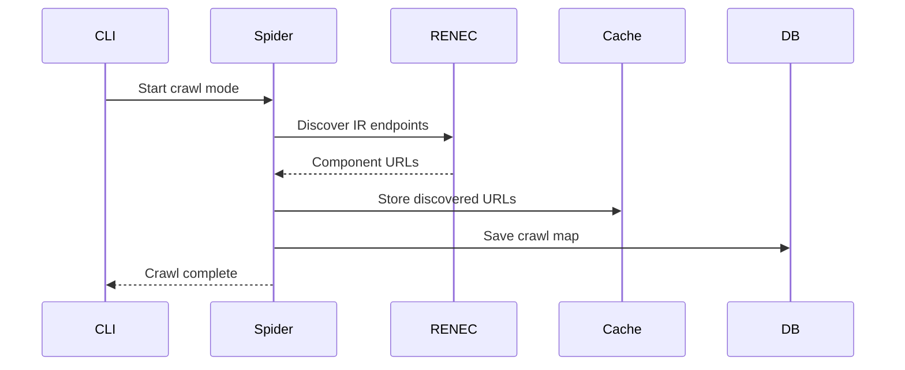
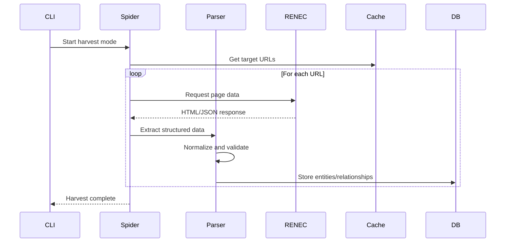
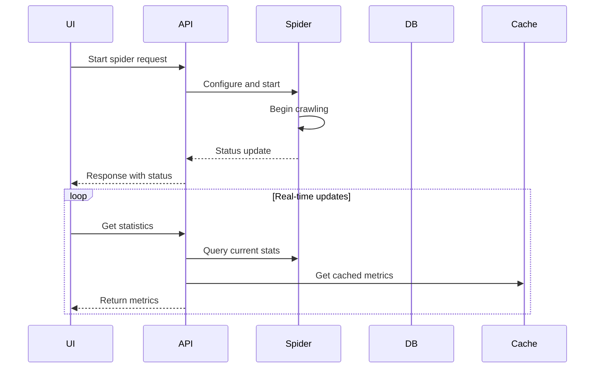

# RENEC Harvester Architecture

## 🏗️ System Overview

The RENEC Harvester is a multi-tier data extraction system designed for scalable, reliable harvesting of public data from México's RENEC platform. The architecture follows a modular design with clear separation of concerns.



## 🧩 Component Architecture

### 1. Web Interface Layer

#### Next.js Frontend (`ui/`)
- **Purpose**: User interface for controlling and monitoring harvesting operations
- **Technology**: Next.js 15, TypeScript, Tailwind CSS
- **Features**:
  - Real-time monitoring dashboard
  - Scraping parameter configuration
  - Data exploration and export
  - Responsive design
- **Port**: 3001

#### FastAPI Backend (`src/api/`)
- **Purpose**: REST API for spider control and data access
- **Technology**: FastAPI, Pydantic, uvicorn
- **Features**:
  - Spider lifecycle management
  - Real-time statistics
  - Data querying and export
  - OpenAPI documentation
- **Port**: 8000

### 2. Core Processing Layer

#### CLI Controller (`src/cli/`)
- **Purpose**: Command-line interface for automated operations
- **Technology**: Typer, Rich
- **Commands**:
  - `crawl`: Site structure discovery
  - `harvest`: Data extraction
  - `validate`: Data quality checks
  - `db`: Database operations

#### Scrapy Spider (`src/discovery/`)
- **Purpose**: Web scraping engine with browser automation
- **Technology**: Scrapy, Playwright, concurrent processing
- **Features**:
  - Site structure crawling
  - Network request interception
  - Concurrent processing (up to 10 contexts)
  - Automatic retry with circuit breakers
  - Polite crawling with rate limiting

#### Data Parser (`src/parse/`)
- **Purpose**: Data extraction, normalization, and validation
- **Technology**: BeautifulSoup, regex, custom validators
- **Features**:
  - HTML parsing and data extraction
  - Data normalization and cleaning
  - Quality validation and error handling
  - Relationship mapping

### 3. Data Layer

#### PostgreSQL Database
- **Purpose**: Primary data storage with relational integrity
- **Features**:
  - ACID compliance
  - Concurrent write support
  - Full-text search capabilities
  - Temporal data tracking (first_seen/last_seen)
- **Schema**: Entities (EC, Certificadores, Centers) + Relationships

#### Redis Cache
- **Purpose**: High-performance caching and session management
- **Features**:
  - Request deduplication
  - Rate limiting data
  - Session state storage
  - API response caching
- **Configuration**: TTL-based expiration, memory optimization

#### File System Storage (`artifacts/`)
- **Purpose**: Artifact storage and export functionality
- **Structure**:
  ```
  artifacts/
  ├── crawl_maps/          # Site structure data
  ├── harvests/            # Raw extraction results
  ├── exports/             # Generated export files
  ├── httpcache/           # HTTP response cache
  └── logs/                # Structured log files
  ```

### 4. Monitoring Layer

#### Prometheus Metrics
- **Purpose**: Time-series metrics collection
- **Metrics**:
  - Request rates and response times
  - Error rates by component
  - System resource utilization
  - Spider performance metrics

#### Grafana Dashboards
- **Purpose**: Metrics visualization and alerting
- **Dashboards**:
  - System overview
  - Spider performance
  - Data quality metrics
  - Error tracking

#### Structured Logging
- **Purpose**: Comprehensive activity logging
- **Format**: JSON structured logs
- **Levels**: DEBUG, INFO, WARN, ERROR
- **Storage**: Rotating file logs

## 🔄 Data Flow Architecture

### 1. Crawl Phase


### 2. Harvest Phase


### 3. API Request Flow


## 🏛️ Design Patterns

### 1. Repository Pattern
- **Location**: `src/models/`
- **Purpose**: Abstract data access layer
- **Benefits**: 
  - Database independence
  - Testability
  - Clean separation of concerns

### 2. Command Pattern
- **Location**: `src/cli/commands/`
- **Purpose**: Encapsulate CLI operations
- **Benefits**:
  - Extensible command system
  - Standardized error handling
  - Easy testing and mocking

### 3. Observer Pattern
- **Location**: `src/monitoring/`
- **Purpose**: Real-time metrics collection
- **Benefits**:
  - Decoupled monitoring
  - Real-time updates
  - Flexible metric collectors

### 4. Strategy Pattern
- **Location**: `src/discovery/spiders/`
- **Purpose**: Pluggable extraction strategies
- **Benefits**:
  - Component-specific extraction
  - Easy to extend for new components
  - Maintainable parsing logic

## 🛡️ Security Architecture

### 1. Network Security
- **HTTPS**: All external communications encrypted
- **Rate Limiting**: Prevents overwhelming target sites
- **User Agent**: Identifies harvester for transparency
- **Robots.txt**: Respects crawling guidelines

### 2. Data Security
- **Input Validation**: All parsed data validated
- **SQL Injection Prevention**: Parameterized queries
- **XSS Protection**: Output encoding
- **Data Sanitization**: Remove PII and sensitive data

### 3. Operational Security
- **Environment Variables**: Secure configuration
- **Logging**: No sensitive data in logs
- **Access Control**: Database user permissions
- **Audit Trail**: Complete operation logging

## 📊 Scalability Considerations

### 1. Horizontal Scaling
- **Spider Scaling**: Multiple spider instances
- **API Scaling**: Load-balanced FastAPI instances
- **Database Scaling**: Read replicas, connection pooling
- **Cache Scaling**: Redis cluster mode

### 2. Performance Optimization
- **Concurrent Processing**: Parallel spider execution
- **Caching Strategy**: Multi-level caching (Redis, HTTP)
- **Database Optimization**: Proper indexing, query optimization
- **Resource Management**: Memory and connection limits

### 3. Reliability Patterns
- **Circuit Breakers**: Prevent cascade failures
- **Retry Logic**: Exponential backoff
- **Health Checks**: Service monitoring
- **Graceful Degradation**: Fallback mechanisms

## 🔧 Configuration Architecture

### 1. Environment-Based Configuration
```yaml
# config/production.yaml
database:
  url: ${DATABASE_URL}
  pool_size: 20
  timeout: 30

redis:
  url: ${REDIS_URL}
  timeout: 5

spider:
  concurrent_requests: 16
  download_delay: 0.5
  respect_robots_txt: true
```

### 2. Component Configuration
- **Spider Settings**: `src/discovery/settings.py`
- **Database Config**: `src/models/base.py`
- **API Config**: `src/api/main.py`
- **Monitoring Config**: `config/prometheus.yml`

## 🚀 Deployment Architecture

### 1. Development Environment
```bash
# Local development with hot reload
./start-ui.sh
```

### 2. Docker Deployment
```yaml
# docker-compose.yml
services:
  harvester-api:
    image: renec-harvester:latest
    environment:
      - DATABASE_URL=postgresql://...
      - REDIS_URL=redis://...
    
  harvester-ui:
    image: renec-harvester-ui:latest
    environment:
      - NEXT_PUBLIC_API_URL=http://api:8000
    
  postgres:
    image: postgres:16-alpine
    
  redis:
    image: redis:7-alpine
```

### 3. Production Considerations
- **Load Balancing**: Nginx/HAProxy for API distribution
- **SSL Termination**: HTTPS certificate management
- **Service Discovery**: Consul/etcd for dynamic configuration
- **Container Orchestration**: Kubernetes deployment

## 📈 Performance Characteristics

### 1. Target Performance Metrics
- **Full Harvest**: ≤20 minutes (with 10 concurrent spiders)
- **API Response**: ≤50ms (with Redis caching)
- **Database Writes**: 1000+ items/second
- **Memory Usage**: ≤2GB per spider instance
- **CPU Usage**: ≤80% during peak harvest

### 2. Bottleneck Analysis
- **Network I/O**: Rate-limited by politeness settings
- **Database I/O**: Optimized with bulk inserts
- **Memory**: Managed with streaming processing
- **CPU**: Efficient parsing with compiled regex

## 🔍 Monitoring and Observability

### 1. Metrics Collection
- **System Metrics**: CPU, memory, disk, network
- **Application Metrics**: Request rates, error rates, latency
- **Business Metrics**: Items scraped, coverage percentage
- **Custom Metrics**: Component-specific KPIs

### 2. Distributed Tracing
- **Request Tracing**: End-to-end request tracking
- **Error Correlation**: Link errors across components
- **Performance Analysis**: Identify slow operations
- **Dependency Mapping**: Service interaction visualization

### 3. Alerting Strategy
- **Error Rate Alerts**: High error rate notifications
- **Performance Alerts**: Latency threshold breaches
- **Capacity Alerts**: Resource utilization warnings
- **Business Alerts**: Data quality issues

## 🧪 Testing Architecture

### 1. Testing Strategy
- **Unit Tests**: Individual component testing
- **Integration Tests**: Component interaction testing
- **End-to-End Tests**: Full workflow validation
- **Performance Tests**: Load and stress testing

### 2. Test Environment
- **Mock Services**: External dependency mocking
- **Test Databases**: Isolated test data
- **CI/CD Integration**: Automated test execution
- **Coverage Reporting**: Code coverage analysis

This architecture provides a robust, scalable foundation for the RENEC Harvester system while maintaining flexibility for future enhancements and modifications.