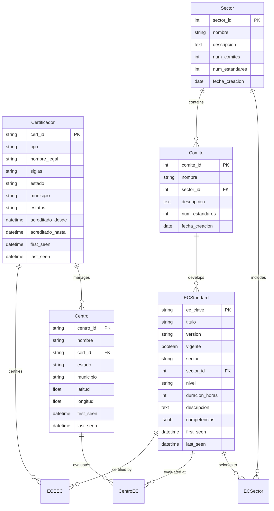

# Database Schema Documentation

## Overview

The RENEC Harvester uses PostgreSQL as its primary database with a normalized schema designed for efficient querying and data integrity. The schema supports temporal tracking, relationships between entities, and flexible metadata storage.

## Entity Relationship Diagram



## Core Tables

### ec_standards_v2

Stores EC (Estándar de Competencia) standards information.

| Column | Type | Constraints | Description |
|--------|------|-------------|-------------|
| ec_clave | VARCHAR(20) | PRIMARY KEY | Unique EC identifier (e.g., "EC0217") |
| titulo | VARCHAR(500) | NOT NULL | Standard title |
| version | VARCHAR(10) | | Version number |
| vigente | BOOLEAN | DEFAULT true | Active status |
| sector | VARCHAR(200) | | Sector name |
| sector_id | INTEGER | FOREIGN KEY | Reference to sectors table |
| comite | VARCHAR(200) | | Committee name |
| comite_id | INTEGER | FOREIGN KEY | Reference to comites table |
| nivel | VARCHAR(10) | | Competency level (1-5) |
| duracion_horas | INTEGER | | Duration in hours |
| descripcion | TEXT | | Detailed description |
| competencias | JSONB | | Array of competencies |
| ocupaciones | JSONB | | Related occupations |
| first_seen | TIMESTAMP | NOT NULL | First detection date |
| last_seen | TIMESTAMP | NOT NULL | Last update date |
| src_url | TEXT | | Source URL |
| content_hash | VARCHAR(64) | | Content hash for change detection |

Indexes:
- `idx_ec_vigente`: ON (vigente)
- `idx_ec_sector_id`: ON (sector_id)
- `idx_ec_titulo_search`: GIN index ON titulo for full-text search

### certificadores_v2

Stores certifying organizations (ECE and OC).

| Column | Type | Constraints | Description |
|--------|------|-------------|-------------|
| cert_id | VARCHAR(20) | PRIMARY KEY | Unique certificador ID |
| tipo | VARCHAR(10) | NOT NULL | Type (ECE or OC) |
| nombre_legal | VARCHAR(300) | NOT NULL | Legal name |
| siglas | VARCHAR(50) | | Abbreviation |
| nombre_contacto | VARCHAR(200) | | Contact name |
| correo | VARCHAR(200) | | Email address |
| telefono | VARCHAR(50) | | Phone number |
| direccion | TEXT | | Street address |
| municipio | VARCHAR(200) | | Municipality |
| estado | VARCHAR(100) | | State name |
| estado_inegi | VARCHAR(2) | | INEGI state code |
| cp | VARCHAR(10) | | Postal code |
| estatus | VARCHAR(50) | | Status (Vigente, etc.) |
| acreditado_desde | DATE | | Accreditation start |
| acreditado_hasta | DATE | | Accreditation end |
| first_seen | TIMESTAMP | NOT NULL | First detection date |
| last_seen | TIMESTAMP | NOT NULL | Last update date |
| src_url | TEXT | | Source URL |

Indexes:
- `idx_cert_tipo`: ON (tipo)
- `idx_cert_estado_inegi`: ON (estado_inegi)
- `idx_cert_estatus`: ON (estatus)

### centros

Stores evaluation centers information.

| Column | Type | Constraints | Description |
|--------|------|-------------|-------------|
| centro_id | VARCHAR(20) | PRIMARY KEY | Unique center ID |
| nombre | VARCHAR(300) | NOT NULL | Center name |
| cert_id | VARCHAR(20) | FOREIGN KEY | Managing certificador |
| nombre_contacto | VARCHAR(200) | | Contact name |
| correo | VARCHAR(200) | | Email address |
| telefono | VARCHAR(50) | | Phone number |
| direccion | TEXT | | Street address |
| municipio | VARCHAR(200) | | Municipality |
| estado | VARCHAR(100) | | State name |
| estado_inegi | VARCHAR(2) | | INEGI state code |
| cp | VARCHAR(10) | | Postal code |
| latitud | FLOAT | | Latitude coordinate |
| longitud | FLOAT | | Longitude coordinate |
| first_seen | TIMESTAMP | NOT NULL | First detection date |
| last_seen | TIMESTAMP | NOT NULL | Last update date |
| src_url | TEXT | | Source URL |

Indexes:
- `idx_centro_cert_id`: ON (cert_id)
- `idx_centro_estado_inegi`: ON (estado_inegi)
- `idx_centro_location`: GIST index ON (latitud, longitud) for spatial queries

### sectors

Stores productive sectors.

| Column | Type | Constraints | Description |
|--------|------|-------------|-------------|
| id | SERIAL | PRIMARY KEY | Internal ID |
| sector_id | INTEGER | UNIQUE NOT NULL | RENEC sector ID |
| nombre | VARCHAR(200) | NOT NULL | Sector name |
| descripcion | TEXT | | Description |
| num_comites | INTEGER | | Number of committees |
| num_estandares | INTEGER | | Number of standards |
| fecha_creacion | DATE | | Creation date |
| first_seen | TIMESTAMP | NOT NULL | First detection date |
| last_seen | TIMESTAMP | NOT NULL | Last update date |
| src_url | TEXT | | Source URL |

### comites

Stores technical committees.

| Column | Type | Constraints | Description |
|--------|------|-------------|-------------|
| id | SERIAL | PRIMARY KEY | Internal ID |
| comite_id | INTEGER | UNIQUE NOT NULL | RENEC committee ID |
| nombre | VARCHAR(200) | NOT NULL | Committee name |
| sector_id | INTEGER | FOREIGN KEY | Parent sector |
| descripcion | TEXT | | Description |
| num_estandares | INTEGER | | Number of standards |
| fecha_creacion | DATE | | Creation date |
| first_seen | TIMESTAMP | NOT NULL | First detection date |
| last_seen | TIMESTAMP | NOT NULL | Last update date |
| src_url | TEXT | | Source URL |

## Relationship Tables

### ec_ece (ECEEC)

Maps EC standards to certificadores that can certify them.

| Column | Type | Constraints | Description |
|--------|------|-------------|-------------|
| id | SERIAL | PRIMARY KEY | Internal ID |
| ec_clave | VARCHAR(20) | FOREIGN KEY | EC standard |
| cert_id | VARCHAR(20) | FOREIGN KEY | Certificador |
| acreditado_desde | DATE | | Accreditation start |
| acreditado_hasta | DATE | | Accreditation end |
| first_seen | TIMESTAMP | NOT NULL | First detection date |
| last_seen | TIMESTAMP | NOT NULL | Last update date |

Constraints:
- UNIQUE (ec_clave, cert_id)

### centro_ec

Maps evaluation centers to EC standards they can evaluate.

| Column | Type | Constraints | Description |
|--------|------|-------------|-------------|
| id | SERIAL | PRIMARY KEY | Internal ID |
| centro_id | VARCHAR(20) | FOREIGN KEY | Evaluation center |
| ec_clave | VARCHAR(20) | FOREIGN KEY | EC standard |
| fecha_registro | DATE | | Registration date |
| first_seen | TIMESTAMP | NOT NULL | First detection date |
| last_seen | TIMESTAMP | NOT NULL | Last update date |

Constraints:
- UNIQUE (centro_id, ec_clave)

### ec_sector

Maps EC standards to sectors.

| Column | Type | Constraints | Description |
|--------|------|-------------|-------------|
| id | SERIAL | PRIMARY KEY | Internal ID |
| ec_clave | VARCHAR(20) | FOREIGN KEY | EC standard |
| sector_id | INTEGER | FOREIGN KEY | Sector |
| comite_id | INTEGER | | Committee ID |
| comite_nombre | VARCHAR(200) | | Committee name |
| first_seen | TIMESTAMP | NOT NULL | First detection date |
| last_seen | TIMESTAMP | NOT NULL | Last update date |

Constraints:
- UNIQUE (ec_clave, sector_id)

## Supporting Tables

### crawl_results

Stores spider crawl results and metadata.

| Column | Type | Constraints | Description |
|--------|------|-------------|-------------|
| id | SERIAL | PRIMARY KEY | Internal ID |
| spider_name | VARCHAR(50) | NOT NULL | Spider identifier |
| url | TEXT | NOT NULL | Crawled URL |
| status_code | INTEGER | | HTTP status code |
| depth | INTEGER | | Crawl depth |
| parent_url | TEXT | | Parent page URL |
| content_type | VARCHAR(100) | | MIME type |
| content_length | INTEGER | | Response size |
| crawled_at | TIMESTAMP | NOT NULL | Crawl timestamp |
| data | JSONB | | Extracted data |

### spider_stats

Stores spider execution statistics.

| Column | Type | Constraints | Description |
|--------|------|-------------|-------------|
| id | SERIAL | PRIMARY KEY | Internal ID |
| spider_name | VARCHAR(50) | NOT NULL | Spider identifier |
| start_time | TIMESTAMP | NOT NULL | Start timestamp |
| end_time | TIMESTAMP | | End timestamp |
| items_scraped | INTEGER | DEFAULT 0 | Items extracted |
| requests_made | INTEGER | DEFAULT 0 | Total requests |
| errors | INTEGER | DEFAULT 0 | Error count |
| status | VARCHAR(20) | | Final status |
| stats | JSONB | | Detailed statistics |

## Indexes and Performance

### Primary Indexes
- All PRIMARY KEY columns have implicit B-tree indexes
- All FOREIGN KEY columns have explicit indexes for join performance

### Search Indexes
```sql
-- Full-text search on EC standards
CREATE INDEX idx_ec_search ON ec_standards_v2 
USING gin(to_tsvector('spanish', titulo || ' ' || COALESCE(descripcion, '')));

-- Full-text search on certificadores
CREATE INDEX idx_cert_search ON certificadores_v2 
USING gin(to_tsvector('spanish', nombre_legal || ' ' || COALESCE(siglas, '')));

-- Geospatial index for centros
CREATE INDEX idx_centro_geo ON centros 
USING gist(ll_to_earth(latitud, longitud));
```

### Composite Indexes
```sql
-- Common query patterns
CREATE INDEX idx_ec_sector_vigente ON ec_standards_v2(sector_id, vigente);
CREATE INDEX idx_cert_tipo_estado ON certificadores_v2(tipo, estado_inegi);
CREATE INDEX idx_centro_cert_estado ON centros(cert_id, estado_inegi);
```

## Migrations

### Migration Strategy
1. Use Alembic for version control
2. Always test migrations on staging first
3. Include rollback procedures
4. Document breaking changes

### Example Migration
```python
# alembic/versions/003_add_temporal_indexes.py
def upgrade():
    op.create_index('idx_ec_last_seen', 'ec_standards_v2', ['last_seen'])
    op.create_index('idx_cert_last_seen', 'certificadores_v2', ['last_seen'])

def downgrade():
    op.drop_index('idx_ec_last_seen')
    op.drop_index('idx_cert_last_seen')
```

## Data Integrity

### Constraints
- Foreign key constraints with CASCADE options
- Check constraints for valid values
- Unique constraints to prevent duplicates
- NOT NULL constraints for required fields

### Triggers
```sql
-- Update last_seen automatically
CREATE OR REPLACE FUNCTION update_last_seen()
RETURNS TRIGGER AS $$
BEGIN
    NEW.last_seen = CURRENT_TIMESTAMP;
    RETURN NEW;
END;
$$ LANGUAGE plpgsql;

CREATE TRIGGER update_ec_last_seen
BEFORE UPDATE ON ec_standards_v2
FOR EACH ROW EXECUTE FUNCTION update_last_seen();
```

## Query Examples

### Common Queries

```sql
-- Get active EC standards by sector
SELECT ec_clave, titulo, nivel
FROM ec_standards_v2
WHERE sector_id = 1 AND vigente = true
ORDER BY nivel, ec_clave;

-- Find certificadores by state with statistics
SELECT c.estado, c.tipo, COUNT(*) as count,
       COUNT(DISTINCT e.ec_clave) as num_standards
FROM certificadores_v2 c
LEFT JOIN ec_ece e ON c.cert_id = e.cert_id
WHERE c.estatus = 'Vigente'
GROUP BY c.estado, c.tipo
ORDER BY count DESC;

-- Get nearby evaluation centers
SELECT centro_id, nombre, 
       earth_distance(ll_to_earth(19.4326, -99.1332), 
                     ll_to_earth(latitud, longitud)) / 1000 as distance_km
FROM centros
WHERE earth_box(ll_to_earth(19.4326, -99.1332), 10000) @> 
      ll_to_earth(latitud, longitud)
ORDER BY distance_km;
```

### Performance Queries

```sql
-- Check table sizes
SELECT schemaname, tablename, 
       pg_size_pretty(pg_total_relation_size(schemaname||'.'||tablename)) as size
FROM pg_tables
WHERE schemaname = 'public'
ORDER BY pg_total_relation_size(schemaname||'.'||tablename) DESC;

-- Monitor slow queries
SELECT query, mean_exec_time, calls, total_exec_time
FROM pg_stat_statements
WHERE mean_exec_time > 100
ORDER BY mean_exec_time DESC
LIMIT 20;
```

## Maintenance

### Regular Tasks
```sql
-- Update table statistics
ANALYZE;

-- Vacuum tables
VACUUM (VERBOSE, ANALYZE) ec_standards_v2;
VACUUM (VERBOSE, ANALYZE) certificadores_v2;

-- Reindex for performance
REINDEX TABLE ec_standards_v2;
REINDEX TABLE certificadores_v2;
```

### Monitoring Queries
```sql
-- Check for table bloat
SELECT schemaname, tablename, 
       n_live_tup, n_dead_tup,
       round(n_dead_tup::numeric / NULLIF(n_live_tup, 0), 2) as dead_ratio
FROM pg_stat_user_tables
WHERE n_dead_tup > 1000
ORDER BY dead_ratio DESC;

-- Check index usage
SELECT schemaname, tablename, indexname, idx_scan
FROM pg_stat_user_indexes
WHERE idx_scan < 100
ORDER BY idx_scan;
```